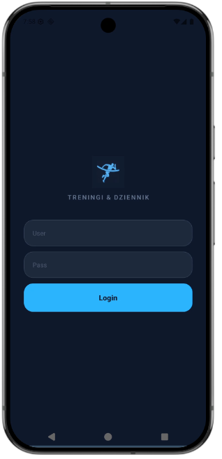
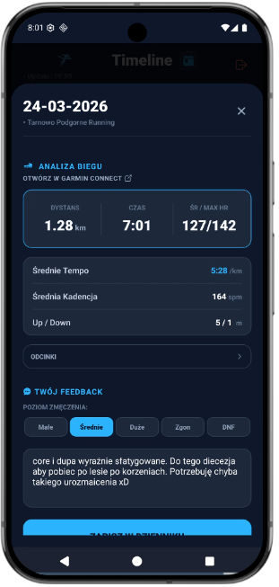
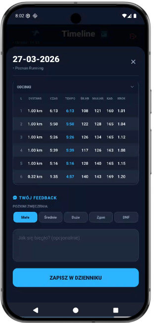
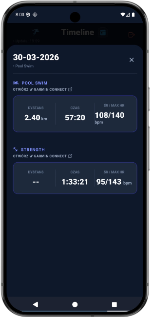
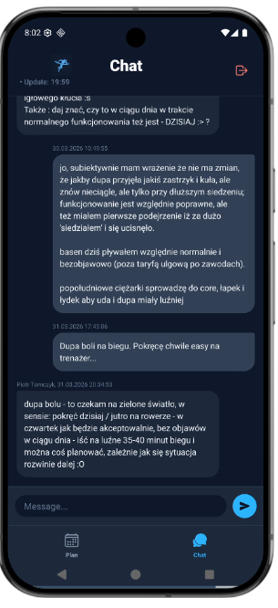

# 🏃‍♂️ #zaliniametyteam app

Twoja podręczna, mobilna nakładka na platformę treningową **planbieganie.pl**. Aplikacja została stworzona po to, aby dać Ci najszybszy i najwygodniejszy dostęp do Twojego planu bezpośrednio z telefonu. 

*Uwaga: Aplikacja pobiera dane z głównego systemu platformy. Nie jest to samodzielny kombajn i nie znajdziesz w niej tak zaawansowanych wykresów czy map jak w samym Garmin Connect 😉. Jej głównym celem jest oszczędność Twojego czasu w codziennej, treningowej rutynie!*

---

## 🎯 Co znajdziesz w aplikacji?

Skupiliśmy się wyłącznie na najpotrzebniejszych funkcjach:

* **Zawsze aktualny plan (Oś Czasu):** Szybki przegląd Twoich zrealizowanych i nadchodzących treningów, zaciągnięty prosto z Twojego konta. Aplikacja dodatkowo odlicza dni do Twoich najbliższych zawodów (🏆).
* **Szybkie podsumowanie (Integracja z Garmin):** Kliknij w wybrany dzień, aby przypomnieć sobie zadanie od trenera i rzucić okiem na podstawowe statystyki wykonania (dystans, tempo, średnie tętno, odcinki). Jeśli chcesz zagłębić się w detale – aplikacja posiada przycisk, który od razu przeniesie Cię do pełnej, oryginalnej aplikacji Garmin Connect.
* **Błyskawiczny Dzienniczek:** Raportowanie treningu zajmuje teraz dosłownie sekundy. Po biegu oceniasz poziom zmęczenia (od "Małe" po "Zgon") za pomocą przycisków i zostawiasz krótki komentarz dla trenera. Prosto i na temat.
* **Podręczny Czat:** Zwykły, wygodny komunikator tekstowy zintegrowany z platformą, służący do szybkiej wymiany wiadomości i zadawania pytań trenerowi.

---

## 📱 Ekrany Aplikacji

    
    
    
    
    
    

*(Powyższe ekrany prezentują kolejno: Bezpieczne logowanie, zintegrowaną oś czasu, metrykę zsynchronizowaną z Garmin Connect oraz szybki czat z trenerem).*

---

## 📲 Jak zainstalować aplikację (Android)?

Aplikacja znajduje się obecnie w dystrybucji zamkniętej i nie pobierzesz jej ze sklepu Google Play. Aby z niej korzystać, musisz pobrać plik instalacyjny `.apk` i jednorazowo zezwolić swojemu telefonowi na jego uruchomienie.

**Instrukcja krok po kroku:**

1. **Pobierz plik:** Kliknij w otrzymany od nas link, aby pobrać plik `.apk` na swój telefon.
2. **Otwórz plik:** Po zakończeniu pobierania otwórz go (znajdziesz go na pasku powiadomień u góry ekranu lub w aplikacji typu "Pliki" / "Pobrane").
3. **Zezwól na instalację:** Ponieważ plik nie pochodzi z oficjalnego sklepu, system Android zapyta, czy na pewno chcesz go zainstalować ze względów bezpieczeństwa.
   * W okienku ostrzeżenia kliknij **Ustawienia**.
   * Zaznacz przełącznik **Zezwól na instalowanie aplikacji z tego źródła** (czyli zezwól swojej przeglądarce lub menedżerowi plików).
   * Cofnij się o jeden krok (strzałka wstecz).
4. **Zainstaluj:** Kliknij przycisk **Zainstaluj**. 
5. *(Opcjonalnie)* Jeśli Google Play Protect zapyta o skanowanie nieznanej aplikacji, wybierz opcję "Zainstaluj mimo to".

Gotowe! Zaloguj się swoimi standardowymi danymi, których używasz na portalu planbieganie.pl.

---

## 🐛 Zgłaszanie błędów i pomysłów

Aplikacja jest rozwijana "po godzinach", więc jeśli coś u Ciebie nie działa (np. ekran się zawiesza, ucina tekst na Twoim modelu telefonu) lub masz prosty pomysł na fajną funkcję – daj nam znać!

Błędy i sugestie zbieramy oficjalnie w zakładce **Issues** na platformie GitHub:

1. Wejdź na stronę zgłoszeń: **[#zaliniametyteam-app / Issues](https://github.com/tomaszkrajewski/zaliniametyteam-app/issues)** *(aby dodać zgłoszenie, musisz mieć darmowe konto na GitHubie)*.
2. Kliknij zielony przycisk **New issue**.
3. **Tytuł:** Wpisz krótko, o co chodzi (np. *Ucięta klawiatura w oknie czatu*).
4. **Opis:** Napisz nam, jakiego modelu telefonu używasz, co kliknąłeś i co się zepsuło. Jeśli masz taką możliwość, **zrób zrzut ekranu (screen)** i wrzuć go do opisu – bardzo nam to pomoże w lokalizacji problemu.
5. Kliknij **Submit new issue** i gotowe!
